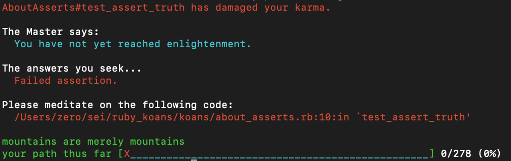
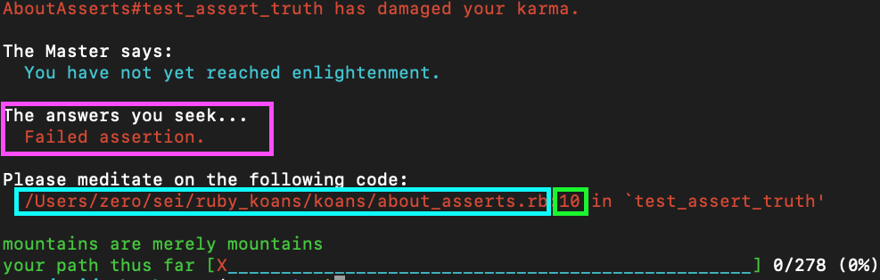

# There's no place like Ruby


## [Ruby Koans](http://rubykoans.com/)

Ruby Koans is a project put together by the "EdgeCase" team that aims to tackle learning the Ruby language, syntax and structure. It takes a unique approach with unit testing. While this project will dive deep into the Ruby language, for this exercise we will just cover the basics.

## SETUP

The starter code in this repo is pulled from EdgeCase's [Ruby Koans Github](https://github.com/edgecase/ruby_koans). There are in-depth instructions in the `README.rdoc` file from their repo but you can quickly get setup by doing the following:

1. Fork and Clone this repo
1. In the root directory of the cloned repo, run: `rake gen`. This will generate all the code that you need to get started.

## TDD

We will be following a Test Driven Development approach in this exercise. This approach is commonly referred to as "Red, Green, Refactor".

- "Red": First fail the test. running `rake` in the root directory will run the built-in testing. Once it fails, look at the terminal response. Why did it fail? Where did it fail?
- "Green": Fix it! The response will give you all the clues that you need to investigate the issue. Go to the section of code that failed and fix it to pass the test. Right now, we are only coding towards the tests.
- "Refactor": Just because our code passes the test, doesn't mean that we are done. Look at the code, study it, pick it apart. This is the most important part of this exercise!!! You will learn a lot from seeing how things are working.

#### Test Example:



Make sure to keep an eye on the important bits of this response:



1. pink - "What failed" this is the response message from the failed test and while often have clues
1. blue - The file that failed. It's easy to find yourself stuck on a test to later find out that you were in the wrong file.
1. green - The line of code that failed. This will be the line of code for the test. It may not always be the line thats incorrect. Make sure to take a look at the entire block of code that this line is in.

## Getting Started

Run `rake` to fail your first test. You can run this manually every time you wish to test your code.


-- OR --


You can use a gem package called `observr` to automatically re-run your tests:

```bash
gem install observr
observr ./koans/koans.watchr
```
This will watch your `/koans/` directory for changes and automatically call `rake` for you.

---


- Some of the later concepts we have not covered, but use the testing to your advantage. It will steer you in the right direction.

- You can ask for help if you get stuck but please do your best to figure these out on your own. The path to enlightenment is achievable even with no prior knowledge of Ruby.

## Goal

Complete <strong>122</strong> Koans. It sounds like a lot but don't worry. They go quickly. Even if you take the time to stop and ponder the code. There will be built-in questions to ask yourself as well! Use Google and the [Ruby docs](https://ruby-doc.org/core-3.0.1/) to help.

> Remember "Mountains are merely mountains"!

## Bonus

Do them all!!! It is a tough challenge but you will come out the other side a much stronger ruby developer
